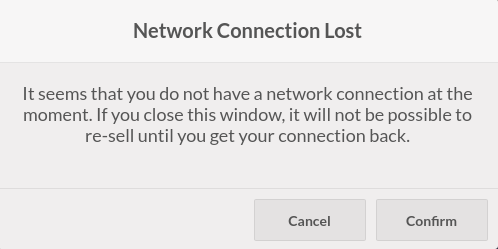
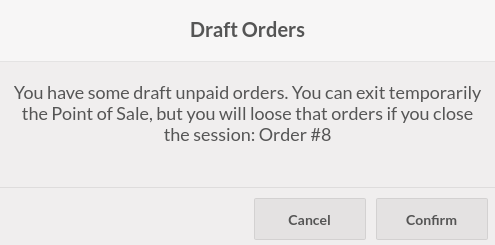

This module was written to extend the functionality of Odoo Point Of Sale,
adding extra checks when exiting the Point of Sale front office UI.

* The cashier has the possibility to trigger turnover_totals and end_of_day actions on the payment terminal

* If the cashier doesn't have a connection to the Odoo server, a message will
  be displayed.

* If the current session contains unpaid draft orders, a message will be displayed.

